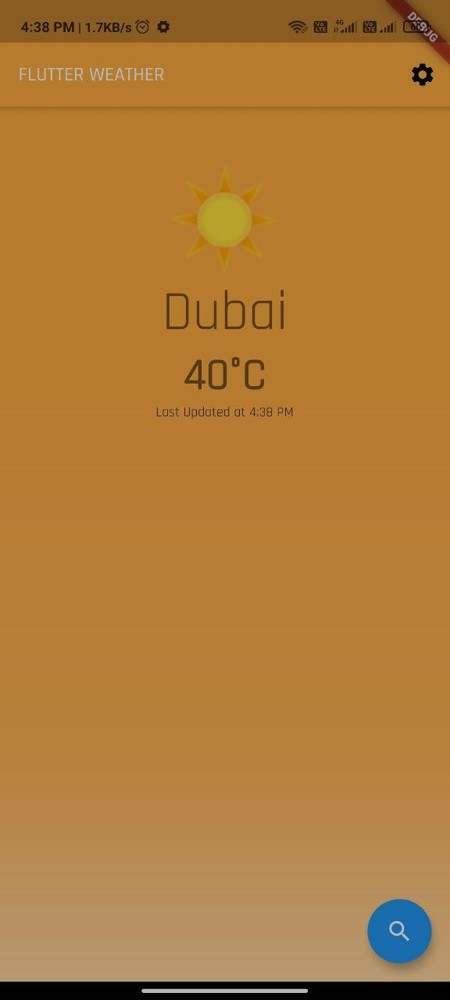
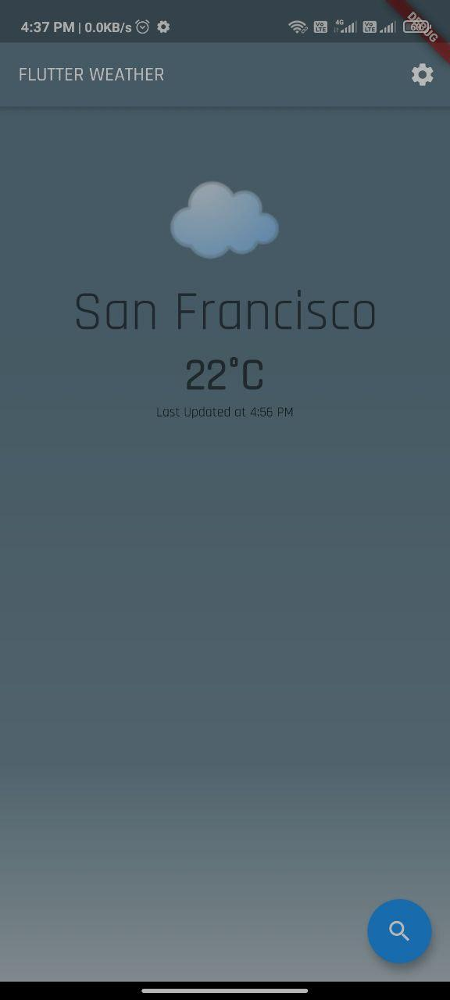
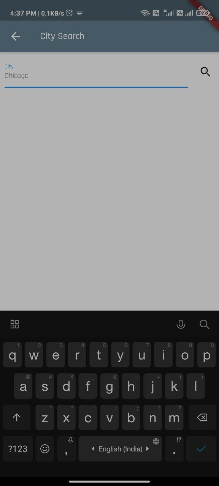
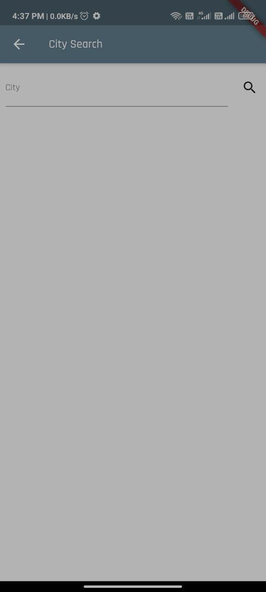
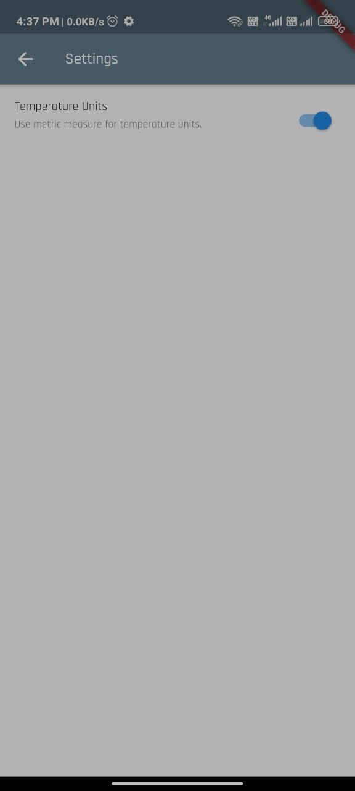
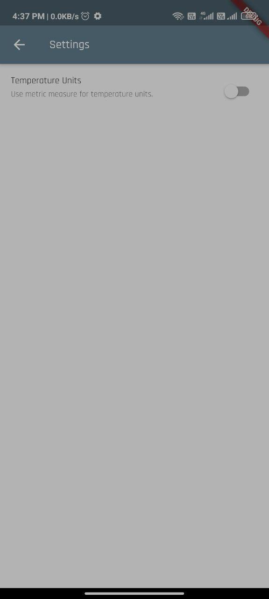

# flutter_weather

A new Flutter project.

## Getting Started

This project is a starting point for a Flutter application.

## Summary
We're going to build a Weather app in Flutter which demonstrates how to manage multiple blocs to implement dynamic theming, pull-to-refresh, and much more. Our weather app will pull real data from an API and demonstrate how to separate our application into layers (data, repository, business logic, and presentation).

## Project Requirements
- User can search for cities on the search page
- App displays weather information returned by MetaWeather API
- App theme changes depending on weather of the city
- Settings page which allows users to change units
- Persist state across sessions (HydratedBloc)

## Key Concepts
- Observe state changes with BlocObserver
- BlocProvider, Flutter widget that provides a bloc to its children
- BlocBuilder, Flutter widget that handles building the widget in response to new states
- Prevent unnecessary rebuilds with Equatable
- RepositoryProvider, a Flutter widget that provides a repository to its children
- BlocListener, a Flutter widget that invokes the listener code in response to state changes in the bloc
- MultiBlocProvider, a Flutter widget that merges multiple BlocProvider widgets into one
- BlocConsumer, a Flutter widget that exposes a builder and listener in order to react to new states
- HydratedBloc to manage and persist state

## Project Structure
Our app can be broken down into four main features: search, settings, theme, weather. Let's create those directories.

flutter_weather

|-- lib/

-  |-- search/

-  |-- settings/
  
-  |-- theme/
  
-  |-- weather/
  
-  |-- main.dart

|-- test/

## Architecture
Following the bloc architecture guidelines, our application will consist of several layers.
- Data: retrieve raw weather data from the API
- Repository: abstract the data layer and expose domain models for the application to consume
- Business Logic: manage the state of each feature (unit information, city details, themes, etc.)
- Presentation: display weather information and collect input from users (settings page, search page etc.)

A few resources to get you started if this is your first Flutter project:

- [Lab: Write your first Flutter app](https://flutter.dev/docs/get-started/codelab)
- [Cookbook: Useful Flutter samples](https://flutter.dev/docs/cookbook)

For help getting started with Flutter, view our
[online documentation](https://flutter.dev/docs), which offers tutorials,
samples, guidance on mobile development, and a full API reference.
